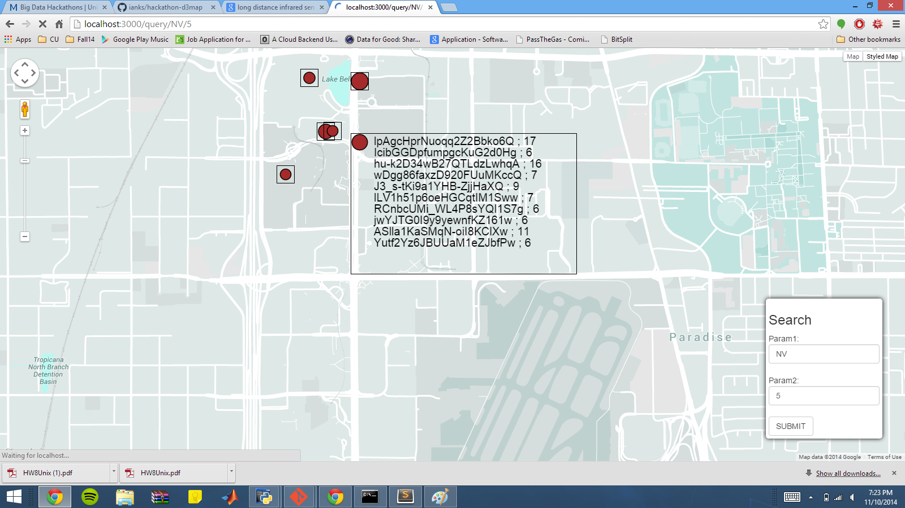
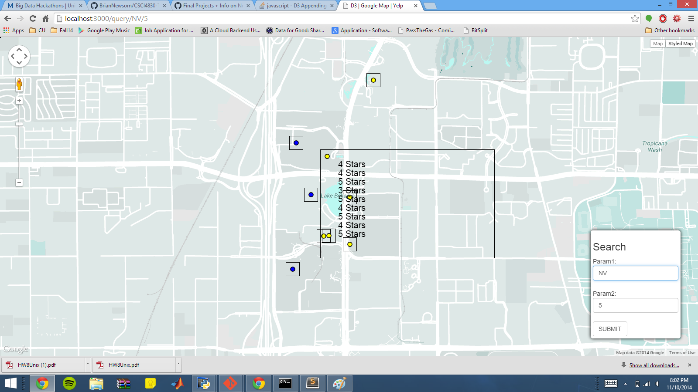
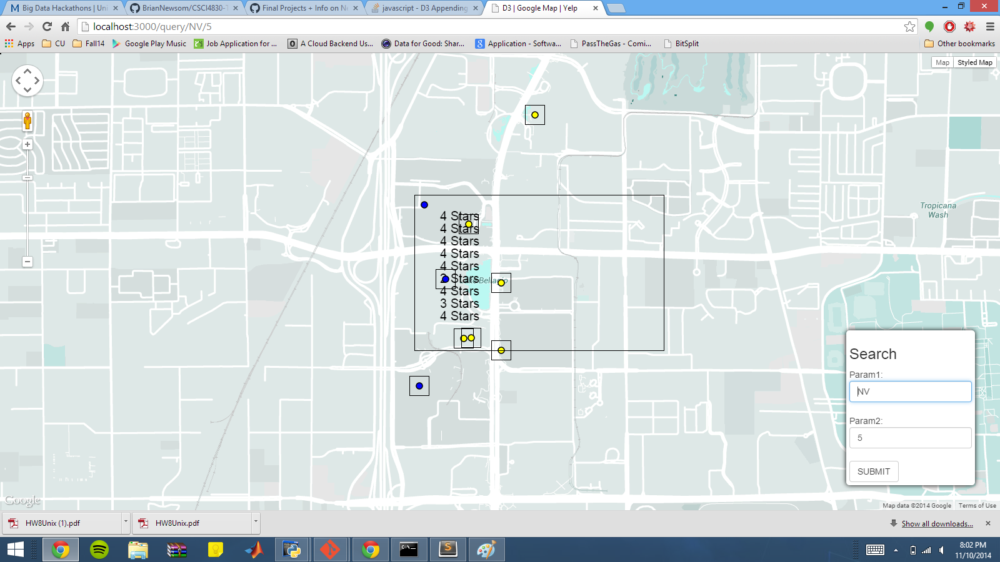
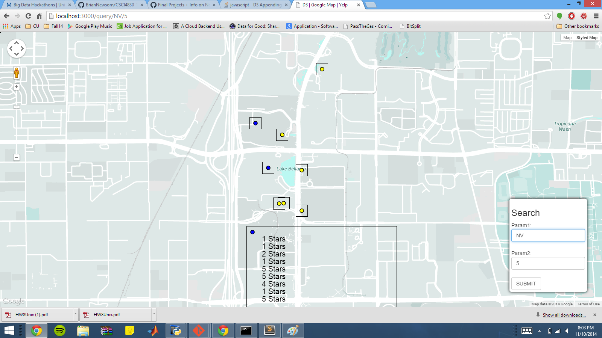
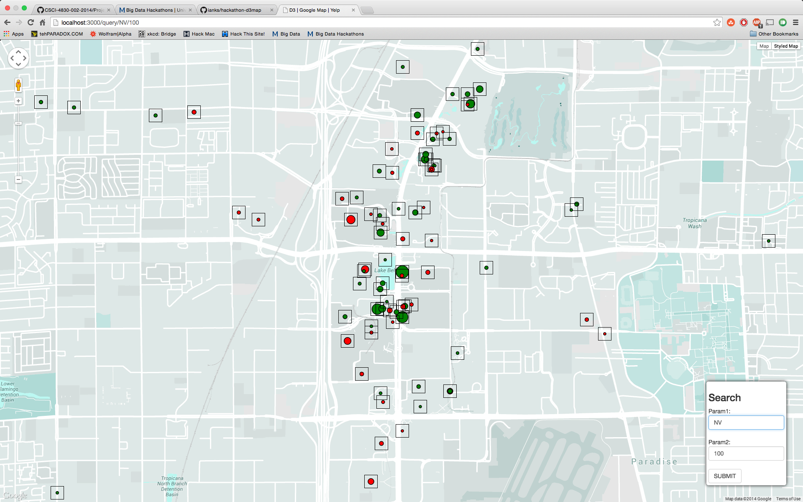

# Team Members

* [name-of-a-team-member](URL to this member's github account)
* [name-of-a-team-member](URL to this member's github account)
* [name-of-a-team-member](URL to this member's github account)
* [name-of-a-team-member](URL to this member's github account)
* [name-of-a-team-member](URL to this member's github account)

# Objective 1. Warmup

## Star Rating --> Color

## Review Count --> Size

# Objective 2. Customization

## Feature 1

Implemented by: {{ name-of-a-team-member }}

{{ brief description }}

## Feature 2

Implemented by: {{ name-of-a-team-member }}

{{ brief description }}

## Feature 3

Implemented by: Michael Fyk

Lost DB Connection: Added Code Files. Allows users to set params for min and max review count to filter the query.

[app.js](MikeFykapp.js)
[business_map.html](MikeFbusiness_map.html)

## Feature 4

Implemented by: Brian Newsom

Show stars given by 10 reviews on mouseover instead of weird review id stuff.

## Feature 5

Implemented by: Adrian Chen

This functionality turns the color of the dot green if the stars are above average and red if they are below average.

