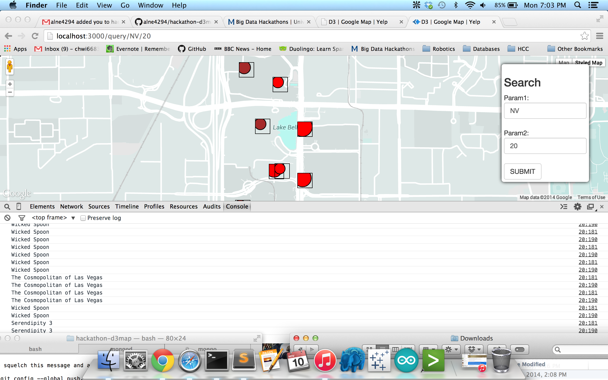
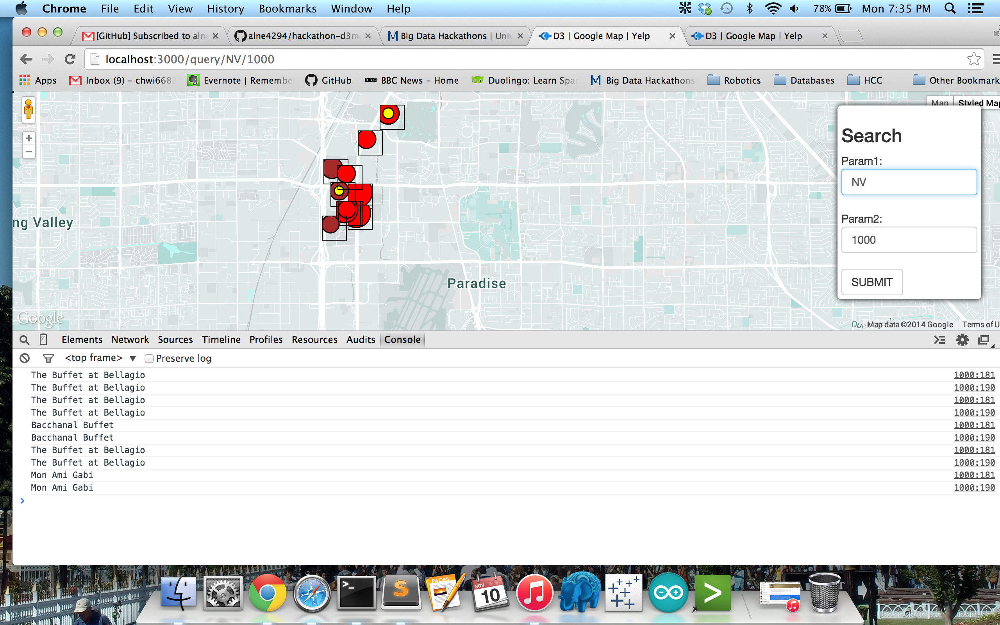

# Team Members

* [Josh Ferge](www.github.com/JoshFerge) 
* [Alexia Newgord](www.github.com/alne4294)
* [Chris Wittenberg](www.github.com/cwitty1919)
* [Nikita Voskoboynik](www.github.com/nikitavoskoboynik)
* [Justin McBride](www.github.com/dare599z)
* [Daniel Nolan](www.github.com/dano8957)

# Objective 1. Warmup

## Star Rating --> Color

## Review Count --> Size

# Objective 2. Customization

## Feature 1

Implemented by: Chris Wittenberg	

If the business is good for kids, it has a yellow circle in the middle.

## Feature 2

Implemented by: {{ Alexia and Daniel }}

Note: We partnered on this because Daniel's node isn't working.

When you hover over a business, the html will show a graphical representation of the number of stars for that business.

[Imgur](http://i.imgur.com/9O5RwjF.png?1)

## Feature 3

Implemented by: {{ name-of-a-team-member }}

{{ brief description }}

## Feature 4

Implemented by: {{ name-of-a-team-member }}

{{ brief description }}

## Feature 5

Implemented by: {{ name-of-a-team-member }}

{{ brief description }}

